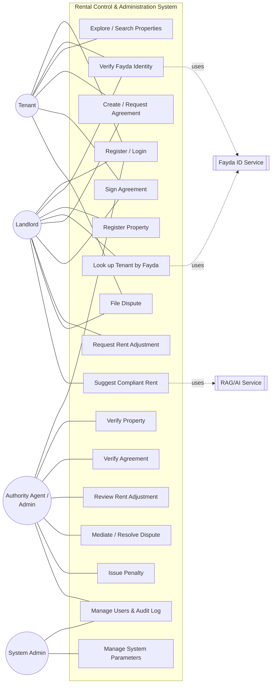
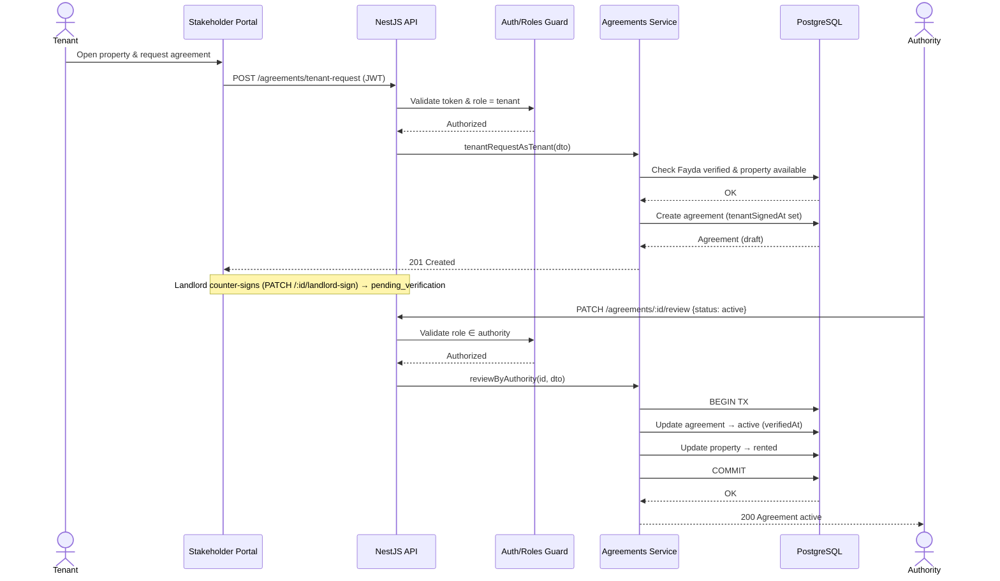
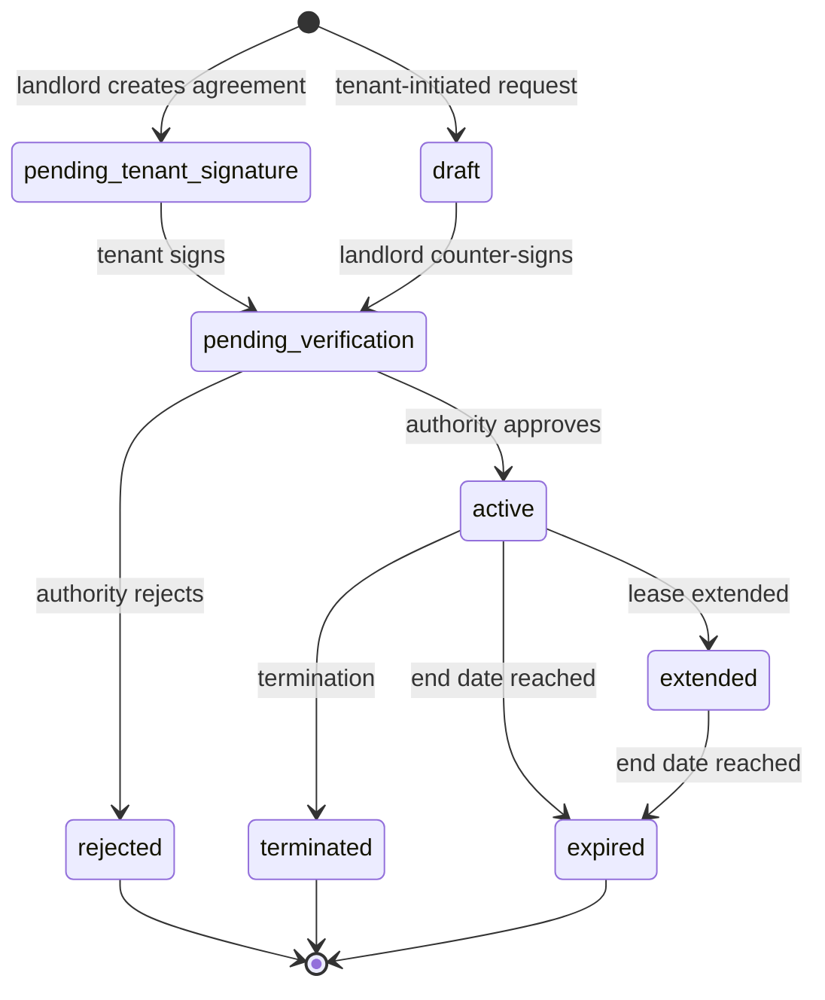
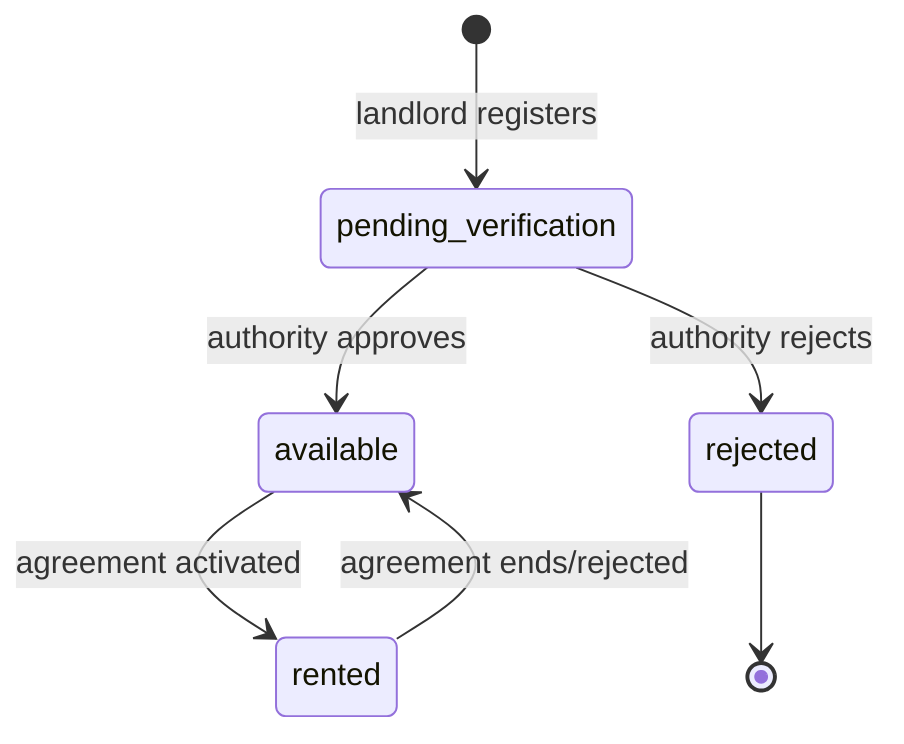
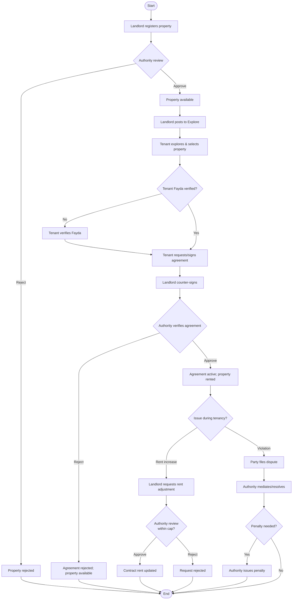
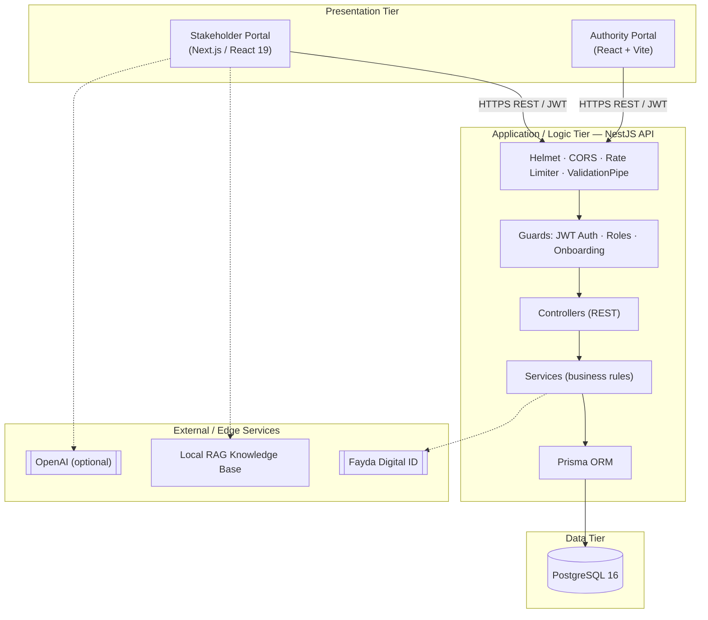
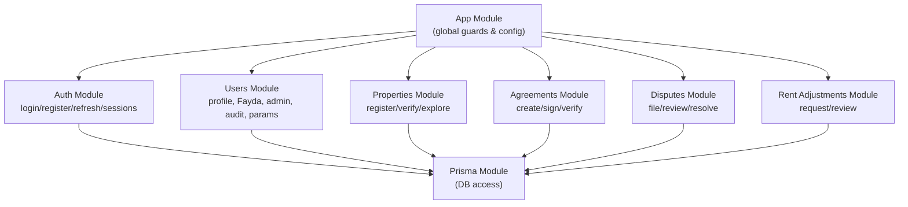
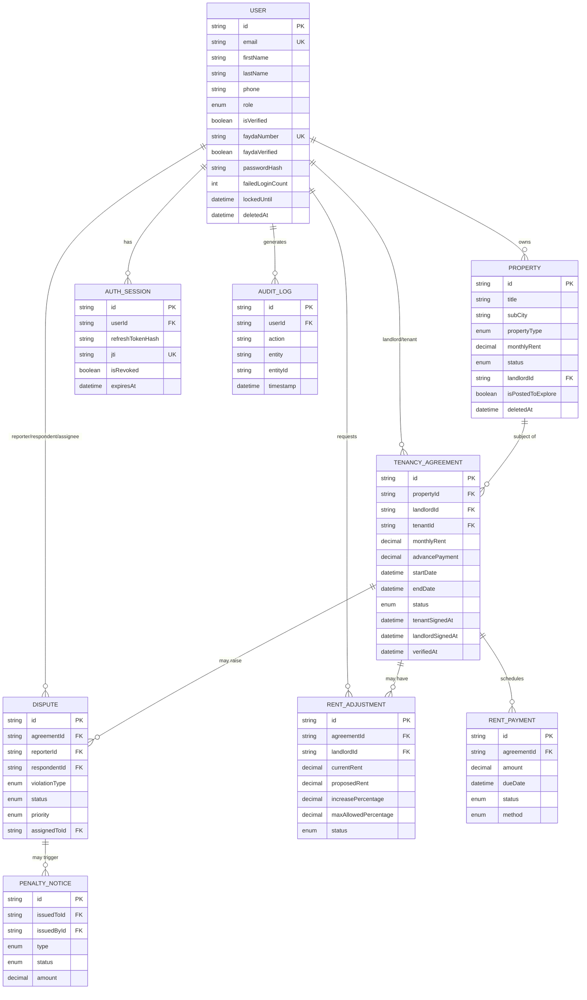
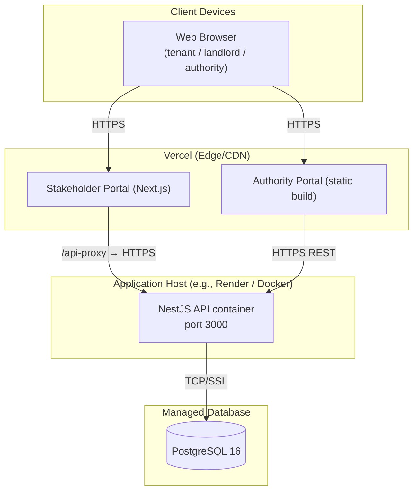

<div align="center">

# Addis Ababa Science and Technology University
## College of Engineering
### Department of Software Engineering

<br/>

# Web-Based Residential House Rental Control and Administration System for Addis Ababa

<br/>

**A Senior Research Project Document Submitted in Partial Fulfilment of the Requirements for the Degree of Bachelor of Science in Software Engineering**

<br/>

**Group Members:**

| No. | Name (Alphabetical order) | ID |
|-----|---------------------------|-----|
| 1 | _________________________ | _________ |
| 2 | _________________________ | _________ |
| 3 | _________________________ | _________ |
| 4 | _________________________ | _________ |
| 5 | _________________________ | _________ |

<br/>

**Advisor Name:** _______________________  **Signature:** ________________

<br/>

**Addis Ababa, Ethiopia**

**[MONTH, YEAR]**

</div>

---

> **How to use this document.** This report is generated directly from the three project repositories
> (`AARentalManagementSystemBackend`, `AARentalManagementSystemFrontend`, and
> `AARentalManagementSystemAuthorityFrontend`). All diagrams are written in
> [Mermaid](https://mermaid.js.org/) and render automatically on GitHub. To produce the final
> submission copy, paste the chapters into your university template, replace the placeholders in the
> title page, regenerate the Table of Contents, and export the rendered diagrams as figures. Wherever a
> claim is made about system behaviour, the corresponding source file is cited so the work can be
> verified by the advisor.

---

# I. Acknowledgement

First and foremost, we would like to express our deepest gratitude to the Almighty God for granting us
the health, patience, and perseverance to complete this senior project.

We extend our sincere appreciation to our advisor, **[Advisor Name]**, whose continuous guidance,
constructive criticism, and encouragement shaped this work from the proposal stage to the final
artifact. We are equally grateful to the **Department of Software Engineering, Addis Ababa Science and
Technology University**, and its instructors for the knowledge and foundation that made this project
possible.

We would also like to thank the staff of the relevant rental administration offices, the landlords, and
the tenants who participated in our requirement-gathering interviews and surveys. Their insight into the
real challenges of the Addis Ababa rental market grounded our design in genuine needs. Finally, we
thank our families and friends for their unconditional support throughout our studies.

---

# II. Table of Contents

- [I. Acknowledgement](#i-acknowledgement)
- [II. Table of Contents](#ii-table-of-contents)
- [III. List of Tables and Figures](#iii-list-of-tables-and-figures)
- [IV. List of Abbreviations](#iv-list-of-abbreviations)
- [V. Abstract](#v-abstract)
- [Chapter One: Introduction](#chapter-one-introduction)
  - [1.1 Statement of the Problem](#11-statement-of-the-problem)
  - [1.2 Objectives](#12-objectives)
  - [1.3 Scope and Limitation](#13-scope-and-limitation)
  - [1.4 Methodology](#14-methodology)
  - [1.5 Plan of Activities](#15-plan-of-activities)
  - [1.6 Budget Required](#16-budget-required)
  - [1.7 Significance of the Study](#17-significance-of-the-study)
  - [1.8 Outline of the Study](#18-outline-of-the-study)
- [Chapter Two: Literature Review](#chapter-two-literature-review)
  - [2.1 Study of Related Works](#21-study-of-related-works)
  - [2.2 Milestones of the Related Literature and the Gaps](#22-milestones-of-the-related-literature-and-the-gaps)
  - [2.3 Lessons Learned from the Literature](#23-lessons-learned-from-the-literature)
- [Chapter Three: Problem Analysis and Modeling](#chapter-three-problem-analysis-and-modeling)
  - [3.1 Existing System and Its Problems](#31-existing-system-and-its-problems)
  - [3.2 Specifying the Requirements of the Proposed Solution](#32-specifying-the-requirements-of-the-proposed-solution)
  - [3.3 System Modeling](#33-system-modeling)
  - [3.4 Model Validation](#34-model-validation)
- [Chapter Four: System Design](#chapter-four-system-design)
  - [4.1 Overview](#41-overview)
  - [4.2 Specifying the Design Goals](#42-specifying-the-design-goals)
  - [4.3 System Design](#43-system-design)
  - [4.4 Verifying the Requirements in the Design](#44-verifying-the-requirements-in-the-design)
- [Chapter Five: System Implementation](#chapter-five-system-implementation)
  - [5.1 Reviewing the Design Solution](#51-reviewing-the-design-solution)
  - [5.2 Deciding on the Development Tools](#52-deciding-on-the-development-tools)
  - [5.3 Developing the Solution](#53-developing-the-solution)
- [Chapter Six: System Evaluation](#chapter-six-system-evaluation)
  - [6.1 Preparing Sample Test Plans](#61-preparing-sample-test-plans)
  - [6.2 Evaluating the Proposed Design and Solutions](#62-evaluating-the-proposed-design-and-solutions)
  - [6.3 Discussing the Results](#63-discussing-the-results)
- [Chapter Seven: Conclusions and Recommendations](#chapter-seven-conclusions-and-recommendations)
  - [7.1 Conclusion of the Study](#71-conclusion-of-the-study)
  - [7.2 Recommendations of the Study](#72-recommendations-of-the-study)
- [References](#references)
- [Appendices](#appendices)

---

# III. List of Tables and Figures

**List of Tables**

| Table | Caption |
|-------|---------|
| Table 1.1 | Plan of Activities |
| Table 1.2 | Estimated Project Budget |
| Table 2.1 | Comparison of Related Systems and Identified Gaps |
| Table 3.1 | Actor Identification |
| Table 3.2 | Functional Requirements Summary |
| Table 3.3 | Non-Functional Requirements |
| Table 3.4 | Use Case Description: Tenant Requests / Signs Agreement |
| Table 3.5 | Use Case Description: Authority Verifies Agreement |
| Table 4.1 | Design Goals and Trade-offs |
| Table 4.2 | Subsystem (Module) Decomposition |
| Table 4.3 | Database Entities and Constraints |
| Table 4.4 | REST API Endpoint Catalogue |
| Table 4.5 | Requirements-to-Design Traceability |
| Table 6.1 | Sample Functional Test Cases |
| Table 6.2 | Non-Functional / Security Test Cases |

**List of Figures**

| Figure | Caption |
|--------|---------|
| Fig. 3.1 | Use Case Diagram of the System |
| Fig. 3.2 | Sequence Diagram — Tenant Signs and Authority Verifies an Agreement |
| Fig. 3.3 | State Machine Diagram — Tenancy Agreement Lifecycle |
| Fig. 3.4 | State Machine Diagram — Property Lifecycle |
| Fig. 3.5 | Activity Diagram — End-to-End Rental Workflow |
| Fig. 3.6 | Collaboration (Communication) Diagram — Rent Adjustment Review |
| Fig. 4.1 | Proposed Three-Tier Software Architecture |
| Fig. 4.2 | Subsystem Decomposition (Component Diagram) |
| Fig. 4.3 | Entity-Relationship / Class Diagram |
| Fig. 4.4 | Deployment Diagram |
| Fig. 4.5 | Authentication & Authorization Security Flow |

---

# IV. List of Abbreviations

| Abbreviation | Meaning |
|--------------|---------|
| API | Application Programming Interface |
| AASTU | Addis Ababa Science and Technology University |
| CRUD | Create, Read, Update, Delete |
| CUID | Collision-resistant Unique Identifier |
| DARA | (Rental) Control and Administration Authority — the regulatory body |
| DTO | Data Transfer Object |
| ERD | Entity-Relationship Diagram |
| ETB | Ethiopian Birr |
| Fayda | Ethiopian National Digital ID (FAN — Fayda Account Number) |
| FR | Functional Requirement |
| JWT | JSON Web Token |
| NFR | Non-Functional Requirement |
| ORM | Object-Relational Mapping |
| RAG | Retrieval-Augmented Generation |
| RBAC | Role-Based Access Control |
| REST | Representational State Transfer |
| SPA | Single-Page Application |
| SQL | Structured Query Language |
| SSR | Server-Side Rendering |
| TLS | Transport Layer Security |
| UI/UX | User Interface / User Experience |
| UML | Unified Modeling Language |

---

# V. Abstract

*The residential rental market of Addis Ababa is large, fast-growing, and predominantly informal.
Rental agreements are frequently verbal or paper-based, rent increases are unregulated in practice,
deposits are withheld without recourse, and tenants and landlords have no trustworthy, neutral channel
for resolving disputes. The recent residential rental proclamation introduces caps on rent increases,
limits on advance payments, and minimum lease terms, but the supervising authority lacks a digital
instrument to register, monitor, and enforce these rules at scale. This project designs and implements a
**Web-Based Residential House Rental Control and Administration System** that digitizes the entire
rental lifecycle — property registration and verification, identity verification through the Ethiopian
**Fayda** national digital ID, digital agreement creation and dual e-signing, authority verification,
rent-adjustment approval bounded by policy caps, dispute filing and mediation, penalty issuance, and an
immutable audit trail. The platform is built as three coordinated applications: a **NestJS + Prisma +
PostgreSQL** REST API enforcing all business rules and role-based access control; a **Next.js** public
and stakeholder portal for tenants and landlords that also embeds a Retrieval-Augmented-Generation
(RAG) assistant suggesting compliant rent prices; and a dedicated **React (Vite)** authority portal for
government agents. The system was modeled using UML, designed with a layered three-tier architecture,
and evaluated against a structured suite of functional, security, and non-functional test cases. The
results show that the platform reliably enforces proclamation rules (e.g., rejecting illegal rent
increases, requiring Fayda verification before contracting, and locking accounts after repeated failed
logins) while remaining usable for non-technical stakeholders. The artifact demonstrates that a
transparent, compliant, and auditable digital rental ecosystem is feasible for Addis Ababa and provides
a foundation that can be extended with integrated payments and richer analytics.*

---

# Chapter One: Introduction

Housing is one of the most pressing socio-economic concerns in Addis Ababa. Rapid urbanization,
internal migration, and a persistent shortage of affordable housing have made renting the dominant form
of tenure for a large share of the city's residents. Despite the size and economic importance of this
market, it operates largely informally: agreements are often verbal, terms are inconsistent, and there
is no centralized record of who rents what, at what price, and under which conditions.

To address abuses such as arbitrary rent increases and unfair evictions, the government has introduced a
residential rental proclamation that, among other measures, caps annual rent increases, limits advance
payments, and sets minimum lease durations. However, a law is only as effective as the mechanism that
enforces it. The supervising rental control and administration authority currently has no digital tool
to register agreements, validate them against the proclamation, monitor compliance, or resolve
disputes. This project responds to that gap by building a software platform that operationalizes the
proclamation and brings transparency to all three stakeholder groups — tenants, landlords, and the
regulator.

The platform described in this report is referred to internally as the **Addis Ababa Residential House
Rental Control and Administration System**. It is implemented as a backend API and two web front-ends
(a public/stakeholder portal and an authority portal), and it integrates with the national **Fayda**
digital identity so that the people behind every agreement are verifiably real.

## 1.1 Statement of the Problem

The Addis Ababa residential rental market suffers from a cluster of interrelated problems:

1. **Informality and lack of records.** Most rental relationships are not registered with any
   authority. There is no single source of truth for agreement terms, rent history, or occupancy, which
   makes oversight, taxation, and policy evaluation almost impossible.
2. **Unregulated rent increases.** Even with a legal cap, there is no automated check that prevents a
   landlord from imposing increases above the permitted percentage; tenants rarely know their rights or
   have evidence to contest an increase.
3. **Identity and trust gaps.** Landlords cannot reliably confirm a prospective tenant's identity, and
   tenants cannot confirm that a "landlord" actually owns the property, enabling fraud on both sides.
4. **Weak dispute resolution.** When conflicts arise (deposit withholding, wrongful eviction,
   maintenance neglect, harassment), there is no structured, neutral, traceable channel to report,
   mediate, and resolve them, nor to issue and track penalties.
5. **No compliance instrument for the regulator.** The authority cannot efficiently verify agreements,
   monitor violations, publish pricing rules per sub-city, or maintain an audit trail of who did what
   and when.

These problems harm tenants (insecurity, exploitation), landlords (fraud, payment uncertainty), and the
state (lost revenue, inability to enforce its own proclamation). The problem is significant because
housing security directly affects livelihoods, and because the proclamation will fail in practice
without a digital enforcement mechanism. This project therefore investigates **how a centralized,
compliance-aware digital platform can make the Addis Ababa rental market transparent, fair, and
enforceable.**

## 1.2 Objectives

### 1.2.1 General Objective

The general objective of this project is **to design and develop a web-based residential house rental
control and administration system for Addis Ababa that digitizes the rental lifecycle and automatically
enforces the residential rental proclamation while providing transparent, auditable oversight to the
regulatory authority.**

### 1.2.2 Specific Objectives

To achieve the general objective, the following specific objectives are pursued:

- To **gather and analyze requirements** from tenants, landlords, and the rental authority through
  interviews, observation, and review of the proclamation.
- To **model the system** using UML (use-case, sequence, state-machine, activity, collaboration, and
  class/ER diagrams) and validate the models against stakeholder needs.
- To **design a secure, layered three-tier architecture** with role-based access control, a normalized
  relational data model, and clearly decomposed subsystems.
- To **implement digital identity verification** by integrating the national Fayda digital ID so that
  every contracting party is verified.
- To **implement the rental lifecycle**: property registration and authority verification, digital
  agreement creation, dual (tenant + landlord) e-signing, and authority verification/activation.
- To **enforce proclamation rules automatically**: rent-increase caps, advance-payment limits, and
  minimum/maximum lease durations through configurable system parameters.
- To **implement dispute management and penalties**, allowing parties to file violations and authority
  agents to mediate, resolve, and issue penalty notices.
- To **provide a compliance and analytics workspace** for the authority, including an immutable audit
  log and configurable system parameters.
- To **assist fair pricing** through a Retrieval-Augmented-Generation (RAG) rent-suggestion feature
  bounded by the regulator's pricing band.
- To **test, evaluate, and deploy** the solution and verify that it satisfies the specified functional
  and non-functional requirements.

## 1.3 Scope and Limitation

### Scope

The project covers the following, all of which are implemented in the accompanying source code:

- **User management and authentication** with five roles — tenant, landlord, government administrator
  (`admin`), authority/`dara_agent`, and `system_admin` — using JWT access/refresh tokens, password
  hashing, account lockout, and session management.
- **Fayda identity verification** for tenants and landlords, and Fayda-based tenant lookup for
  landlords.
- **Property management**: registration by landlords, authority verification (approve/reject), and an
  optional public "Explore" listing.
- **Tenancy agreements**: landlord-initiated and tenant-initiated flows, dual e-signing, authority
  verification, and automatic property status transitions.
- **Rent adjustments**: landlord requests bounded by a maximum allowed percentage, with authority
  approval that automatically updates the contract rent.
- **Dispute management**: filing by parties, authority mediation/resolution, and assignment to authority
  agents.
- **Penalty notices, supporting documents, rent-payment records, notifications, pricing strategies, and
  an audit log** as supporting data models.
- **A public landing page and property explorer**, a **stakeholder dashboard**, and a **dedicated
  authority portal**, with bilingual (English/Amharic) UI strings.
- **A RAG-based rent-suggestion assistant** that recommends a compliant monthly rent for a unit.

### Limitation

The following items were considered in scope but are partially implemented or deferred:

- **Online payment gateway integration.** Payment methods (telebirr, CBE Birr, bank transfer, etc.) are
  modeled in the database (`RentPayment`), but live integration with a payment processor is not
  implemented; payments are recorded rather than transacted.
- **Live Fayda government API.** Fayda verification uses the project's verification endpoints and seeded
  identities for demonstration; a production deployment would connect to the official Fayda eKYC API.
- **AI rent suggestion.** The RAG assistant works fully offline using a local knowledge base and
  benchmark heuristics; the optional OpenAI enrichment is only used when an `OPENAI_API_KEY` is
  configured.
- **File storage.** Supporting documents are modeled with a `storageKey`; binary object storage (e.g.,
  S3) is referenced by key rather than fully provisioned in the demo environment.
- **Email/SMS delivery.** Notification preferences exist as system parameters, but external email/SMS
  gateways are not wired in.

## 1.4 Methodology

**Research and requirement methodology.** Requirements were elicited through interviews with landlords
and tenants, observation of current (manual) renting practice, and a study of the residential rental
proclamation to extract concrete, machine-enforceable rules (rent caps, advance-payment limits, lease
durations).

**Software process model.** An **iterative and incremental (Agile-style)** process was followed. Each
module (auth, properties, agreements, disputes, rent adjustments, users/admin) was specified, designed,
implemented, and tested in short cycles, integrating continuously into the shared API and front-ends.

**System modeling.** The system was modeled with **UML** — use-case, sequence, state-machine, activity,
collaboration, and class/ER diagrams — before and during implementation.

**Architecture and implementation style.** A **layered, three-tier client-server architecture** was
adopted. The backend uses the **NestJS** modular pattern (controller → service → repository via the
Prisma ORM), DTO-based validation, and global guards for authentication and authorization. The
front-ends are component-based SPAs/SSR apps.

**Technology stack.**

| Tier | Technology |
|------|-----------|
| Backend API | NestJS 11 (Node.js, TypeScript), Prisma 7 ORM, PostgreSQL 16 |
| Auth & security | JWT (access/refresh), bcrypt, Passport, Helmet, rate-limiting (Throttler), class-validator |
| Stakeholder front-end | Next.js 16 (React 19, App Router), Tailwind CSS 4, Recharts |
| Authority front-end | React 19 + Vite, React Router, Tailwind CSS |
| AI assistance | Local RAG knowledge base with optional OpenAI `gpt-4o-mini` enrichment |
| DevOps | Docker & Docker Compose, environment-variable validation (Joi), Vercel/Render deployment |

**Testing and deployment standards.** Validation is enforced at the boundary with a global
`ValidationPipe` (whitelisting and rejecting unknown fields). Unit testing uses Jest; end-to-end testing
uses Jest + Supertest. The backend ships with a `Dockerfile` and `docker-compose.yml` (API + Postgres),
and the front-ends deploy to Vercel with a same-origin proxy to avoid CORS.

## 1.5 Plan of Activities

**Table 1.1 — Plan of Activities**

| Phase | Key Activities | Deliverable |
|-------|----------------|-------------|
| Phase 1 — Inception | Problem identification, stakeholder interviews, proclamation study | Project proposal |
| Phase 2 — Requirement analysis | Functional/non-functional requirements, actor & use-case identification | SRS |
| Phase 3 — System modeling | UML diagrams, data model, model validation | Analysis models |
| Phase 4 — System design | Architecture, subsystem decomposition, database & UI design, security design | Design document |
| Phase 5 — Implementation | Backend API, stakeholder portal, authority portal, Fayda & RAG features | Working software |
| Phase 6 — Evaluation | Test plans, functional/security/non-functional testing | Test report |
| Phase 7 — Documentation & defense | Final report, presentation, deployment | This document + demo |

## 1.6 Budget Required

Because the project is a software system built primarily on open-source technologies, the dominant costs
are cloud hosting and identity/AI service usage. Hardware refers to the development machines already
available to the team.

**Table 1.2 — Estimated Project Budget**

| Item | Description | Estimated Cost (ETB) |
|------|-------------|----------------------|
| Development hardware | Laptops (team-owned) | — (existing) |
| Internet & data | Development and research period | 4,000 |
| Cloud hosting | API (Render) + DB + front-ends (Vercel) during development | 6,000 |
| Domain name | Optional custom domain | 1,500 |
| AI/identity services | Optional OpenAI/Fayda API usage during testing | 2,000 |
| Printing & binding | Final report copies | 1,500 |
| Contingency | Miscellaneous (10%) | 1,500 |
| **Total** | | **≈ 16,500** |

> The figures above are planning estimates; the development and demonstration of this project were
> achieved using free tiers of open-source tools and cloud platforms.

## 1.7 Significance of the Study

The study contributes value to several stakeholders:

- **Tenants** gain protection from illegal rent increases and unfair practices, verifiable contracts,
  and a neutral channel to file and track disputes.
- **Landlords** gain verified tenants (reducing fraud and default risk), a legally clean digital
  contract, and data-driven, compliant pricing guidance.
- **The regulatory authority** gains a single instrument to register and verify agreements, monitor
  violations, publish per-sub-city pricing rules, issue penalties, and review an immutable audit trail.
- **Government and policy** benefit from accurate market data (rent trends, occupancy, dispute
  statistics) to evaluate and refine housing policy.
- **The software engineering field** benefits from a documented reference implementation of a
  compliance-aware, multi-portal, identity-integrated rental platform suitable for the Ethiopian
  context.

## 1.8 Outline of the Study

The remainder of this document is organized as follows. **Chapter Two** reviews related rental and
property-management systems, identifies their milestones and gaps, and draws lessons. **Chapter Three**
analyzes the existing (manual) system, elicits functional and non-functional requirements, and presents
the UML models. **Chapter Four** presents the system design: architecture, subsystem decomposition,
database design, deployment, UI, integration, and security. **Chapter Five** describes the
implementation — tools chosen and how the solution was developed, with representative code. **Chapter
Six** evaluates the system through test plans and discusses the results. **Chapter Seven** concludes the
study and offers recommendations for future work. The document closes with references and appendices.

---

# Chapter Two: Literature Review

The purpose of this chapter is to position the project within the landscape of existing rental and
property-management solutions. By reviewing what has been built elsewhere — both global commercial
platforms and local/academic efforts — we identify the techniques worth adopting and, more importantly,
the gaps that a compliance-focused Ethiopian system must fill. This review directly informed the
requirements (Chapter Three) and the design decisions (Chapter Four).

## 2.1 Study of Related Works

**a) Global property/rental marketplaces (e.g., Zillow, Apartments.com, Airbnb).** These platforms
excel at listing discovery, rich media, search, and (in some cases) booking and payment. They are
mature in UX and scale. However, they are fundamentally *marketplaces*, not *regulatory instruments*:
they do not enforce a government rent cap, do not verify national identity for legal contracting in the
Ethiopian sense, and do not provide an authority with verification, dispute-mediation, or
penalty-issuance workflows.

**b) Property-management software (e.g., Buildium, AppFolio, Rentec Direct).** These target professional
landlords and property managers with lease tracking, maintenance, and accounting. They assume a
landlord-centric, single-tenant administrative model and a Western legal/payment context. They do not
model a neutral government regulator as a first-class actor and are not localized for Ethiopian
sub-cities, the Fayda ID, or the rental proclamation.

**c) E-government and land/property registration systems.** Public-sector registries demonstrate the
value of authoritative records, audit trails, and identity verification. They emphasize compliance and
traceability but are typically heavyweight, slow to use for everyday renting, and rarely expose a
modern, self-service experience to ordinary tenants and landlords.

**d) Local and academic rental systems.** Prior Ethiopian student/academic projects have built basic
rental CRUD applications (list a house, contact an owner). They establish demand for digitization but
usually stop at listings; they seldom integrate national identity, enforce proclamation rules
automatically, model dispute resolution, or provide a separate authority workspace.

**e) Retrieval-Augmented Generation for domain assistance.** Recent work on RAG shows that grounding a
language model in a curated knowledge base produces reliable, domain-specific answers while avoiding
hallucination. This project applies the idea narrowly and safely: rent suggestions are computed from a
local benchmark/knowledge base and constrained to the regulator's pricing band, with optional LLM
phrasing only.

## 2.2 Milestones of the Related Literature and the Gaps

**Table 2.1 — Comparison of Related Systems and Identified Gaps**

| Capability | Global marketplaces | PM software | E-gov registries | Local academic apps | **This project** |
|------------|:---:|:---:|:---:|:---:|:---:|
| Listing & discovery | ✔ | ✔ | ✖ | ✔ | ✔ |
| National digital ID (Fayda) verification | ✖ | ✖ | partial | ✖ | ✔ |
| Digital agreement + dual e-signing | partial | ✔ | partial | ✖ | ✔ |
| Automatic proclamation enforcement (rent cap, advance, lease term) | ✖ | ✖ | ✖ | ✖ | ✔ |
| Dedicated regulator/authority workspace | ✖ | ✖ | ✔ | ✖ | ✔ |
| Dispute filing, mediation & penalties | partial | partial | ✖ | ✖ | ✔ |
| Immutable audit log | partial | partial | ✔ | ✖ | ✔ |
| Localization (sub-cities, Amharic, ETB) | ✖ | ✖ | partial | partial | ✔ |
| Compliance-bounded AI pricing guidance | ✖ | partial | ✖ | ✖ | ✔ |

The comparison reveals a clear **gap**: no reviewed system simultaneously (i) treats the government
regulator as a first-class actor, (ii) enforces the rental proclamation automatically at the data layer,
(iii) integrates the national Fayda identity, and (iv) localizes for Addis Ababa. This combination is
precisely the niche this project occupies.

## 2.3 Lessons Learned from the Literature

- **Identity is the foundation of trust.** Verifiable identity (Fayda) must precede contracting; the
  system enforces Fayda verification before a tenant can sign an agreement.
- **Compliance must be enforced by code, not by policy alone.** Rent caps and limits are encoded as
  validation rules and configurable system parameters rather than left to user discretion.
- **Separate the regulator's experience.** A dedicated authority portal keeps the oversight workflow
  focused and auditable, distinct from the tenant/landlord experience.
- **Keep AI grounded and bounded.** Pricing guidance is computed deterministically and constrained to a
  policy band; AI only rephrases, it never invents figures outside the band.
- **Audit everything.** An append-only audit log of sensitive actions is essential for a government-grade
  system.

These lessons shaped the requirements and the layered, security-first design presented next.

---

# Chapter Three: Problem Analysis and Modeling

This chapter dissects the current way renting is done in Addis Ababa, specifies the requirements of the
proposed solution, and models the system using UML. Problem analysis ensures we solve the *right*
problem; modeling ensures the solution is well understood before and during implementation.

## 3.1 Existing System and Its Problems

The **existing system is largely manual and informal.** A typical rental transaction proceeds as
follows: a prospective tenant finds a unit through word of mouth, a broker, or scattered social-media
posts; the tenant and landlord negotiate verbally; a handwritten or template paper contract may (or may
not) be signed; advance payment and deposit are exchanged in cash; and no copy is filed with any
authority.

**Stakeholders affected:**

- **Tenants** — exposed to arbitrary rent increases, deposit withholding, and eviction without recourse.
- **Landlords** — exposed to tenant fraud, non-payment, and property misuse; no easy way to verify a
  tenant's identity.
- **Brokers** — introduce cost and opacity, with inconsistent incentives.
- **The rental authority** — blind to the market: no registry, no compliance monitoring, no dispute
  pipeline, no data for policy.

**Problems and their root causes:**

| Problem | Root cause | Impact |
|---------|-----------|--------|
| No central record of agreements | No digital registration channel | No oversight, no taxation, no analytics |
| Illegal rent increases | No automatic enforcement of the cap | Tenant exploitation, housing insecurity |
| Identity fraud (both sides) | No verified identity at contracting | Scams, disputes, mistrust |
| Unresolved disputes | No neutral, traceable process | Conflict escalation, loss of rights |
| Inconsistent contracts | No standardized digital template | Ambiguity, unenforceable terms |

Analytical tools used to understand the problem included **stakeholder interviews**, **observation** of
broker-mediated transactions, and **document analysis** of the proclamation to translate legal clauses
into enforceable parameters (e.g., a maximum annual rent increase percentage and a maximum advance of
two months).

## 3.2 Specifying the Requirements of the Proposed Solution

Requirements were elicited through **interviews** (tenants, landlords, authority staff), **observation**
of current practice, and **document analysis** of the proclamation. They are organized below into
functional and non-functional requirements; the system models in Section 3.3 visualize them.

### Actors

**Table 3.1 — Actor Identification**

| Actor | Description |
|-------|-------------|
| Tenant | Searches/explores properties, verifies Fayda identity, requests and signs agreements, files disputes, views contracts and payments. |
| Landlord | Registers properties, posts to Explore, looks up tenants by Fayda, creates/counter-signs agreements, requests rent adjustments, files disputes. |
| Authority Agent (`dara_agent`) | Verifies properties and agreements, reviews rent adjustments and disputes, issues penalties. |
| Government Administrator (`admin`) | Authority capabilities plus user administration, statistics, and audit-log access. |
| System Administrator (`system_admin`) | All administrator capabilities plus management of system parameters. |
| RAG/AI Service (supporting actor) | Provides compliant rent-price suggestions. |
| Fayda Identity Service (external actor) | Verifies national digital identity. |

## 3.3 System Modeling

### 3.3.1 Functional Requirements

The functional requirements describe what the system must do. They are grouped by module and map
directly to the implemented controllers/services.

**Table 3.2 — Functional Requirements Summary**

| ID | Functional Requirement |
|----|------------------------|
| FR-1 | The system shall allow users to register and log in with a selected role and issue JWT access/refresh tokens. |
| FR-2 | The system shall lock an account after 5 consecutive failed login attempts for 15 minutes. |
| FR-3 | The system shall allow a user to view and update their own profile. |
| FR-4 | The system shall allow tenants and landlords to verify their Fayda national identity. |
| FR-5 | The system shall allow a landlord to look up a tenant by Fayda number (returning a masked public profile). |
| FR-6 | The system shall allow landlords to register properties (created as `pending_verification`). |
| FR-7 | The system shall allow authority users to approve (`available`) or reject properties. |
| FR-8 | The system shall allow landlords to post approved properties to the public Explore listing. |
| FR-9 | The system shall expose a public, paginated, filterable list of explorable properties. |
| FR-10 | The system shall allow a landlord to create an agreement for an available property and a verified tenant. |
| FR-11 | The system shall allow a Fayda-verified tenant to request an agreement for an available property. |
| FR-12 | The system shall require dual e-signatures (tenant and landlord) before authority verification. |
| FR-13 | The system shall allow authority users to verify (`active`) or reject an agreement, updating the property status accordingly. |
| FR-14 | The system shall allow a landlord to request a rent adjustment only on active/extended agreements and only above current rent. |
| FR-15 | The system shall compute the increase percentage and enforce a maximum allowed percentage; on approval, the contract rent is updated automatically. |
| FR-16 | The system shall allow agreement parties to file disputes with a violation type, priority, and evidence. |
| FR-17 | The system shall allow authority users to review, assign, mediate, resolve, or close disputes. |
| FR-18 | The system shall support penalty notices, supporting documents, rent payments, and notifications. |
| FR-19 | The system shall provide authority statistics, a user-administration list, and an immutable audit log. |
| FR-20 | The system shall allow the system administrator to manage configurable system parameters (e.g., rent cap, advance limit, lease durations). |
| FR-21 | The system shall provide a RAG-based rent suggestion bounded by the regulator's pricing band. |

### 3.3.2 Non-Functional Requirements

**Table 3.3 — Non-Functional Requirements**

| ID | Category | Requirement & Metric |
|----|----------|----------------------|
| NFR-1 | Security | Passwords stored as bcrypt hashes (cost factor 12); JWT secrets ≥ 32 chars; HTTP security headers via Helmet. |
| NFR-2 | Security | Role-based access control on every protected endpoint; input whitelisting rejects unknown fields. |
| NFR-3 | Reliability | Database writes that span multiple tables use transactions (e.g., agreement verification updates both agreement and property atomically). |
| NFR-4 | Performance | Common query paths are backed by composite database indexes; the API enforces rate limiting (default 100 requests/60 s). |
| NFR-5 | Usability | Bilingual (English/Amharic) UI, responsive design, clear status badges and guided multi-step flows. |
| NFR-6 | Availability | Stateless API enabling horizontal scaling; containerized deployment with health checks. |
| NFR-7 | Maintainability | Modular NestJS architecture, typed DTOs, ORM-managed schema, and consistent error handling. |
| NFR-8 | Auditability | Sensitive actions are recorded in an append-only audit log with actor, entity, IP, and timestamp. |
| NFR-9 | Privacy | Personal identifiers (phone, Fayda number) are masked in public/landlord-facing profiles. |

### 3.3.3 Use Case

The use-case diagram (Fig. 3.1) shows the principal actors and their interactions with the system.

**Fig. 3.1 — Use Case Diagram of the System**



**Selected use-case descriptions.**

**Table 3.4 — Use Case: Tenant Requests / Signs Agreement**

| Field | Description |
|-------|-------------|
| Use case name | Request / Sign Tenancy Agreement |
| Actor | Tenant |
| Pre-condition | Tenant is authenticated and **Fayda-verified**; the target property is `available`. |
| Main flow | 1. Tenant opens an available property. 2. Tenant requests an agreement (or opens a landlord-initiated one). 3. System validates Fayda verification and property availability. 4. Tenant reviews terms and e-signs. 5. System records `tenantSignedAt` and advances the status toward verification. |
| Alternate flow | If the tenant is not Fayda-verified, the system rejects the request with a verification-required error. |
| Post-condition | Agreement moves to `draft`/`pending_verification`; awaits landlord counter-signature and/or authority verification. |
| Business rules | Fayda verification required (FR-4); no duplicate open agreement on the same property; default 2-year term and 2-month advance when tenant-initiated. |

**Table 3.5 — Use Case: Authority Verifies Agreement**

| Field | Description |
|-------|-------------|
| Use case name | Verify Tenancy Agreement |
| Actor | Authority Agent / Administrator |
| Pre-condition | Agreement is in `pending_verification`; actor has an authority role. |
| Main flow | 1. Authority opens the pending agreement. 2. Reviews parties, terms, and documents. 3. Approves (`active`) or rejects. 4. System, in a single transaction, updates the agreement and sets the property to `rented` (approve) or `available` (reject). |
| Post-condition | Agreement is `active` (or `rejected`); property status synchronized. |
| Business rules | Only authority roles may review (FR-13); only `pending_verification` agreements are reviewable; status must be `active` or `rejected`. |

### 3.3.4 Dynamic Models of the System

#### 3.3.4.1 Sequence Diagram

**Fig. 3.2 — Sequence Diagram: Tenant Signs and Authority Verifies an Agreement**



#### 3.3.4.2 State Machine Diagrams

**Fig. 3.3 — State Machine: Tenancy Agreement Lifecycle**



**Fig. 3.4 — State Machine: Property Lifecycle**



#### 3.3.4.3 Activity Diagram

**Fig. 3.5 — Activity Diagram: End-to-End Rental Workflow**



#### 3.3.4.4 Collaboration (Communication) Diagram

**Fig. 3.6 — Collaboration Diagram: Rent Adjustment Review**

```mermaid
flowchart LR
    L["Landlord"] -->|1: request adjustment| C["RentAdjustments Controller"]
    C -->|2: create(dto)| S["RentAdjustments Service"]
    S -->|3: validate active & cap| DB[("Database")]
    A["Authority"] -->|4: review(approve)| C
    C -->|5: review(dto)| S
    S -->|6: TX update adjustment| DB
    S -->|7: update agreement rent| DB
```

## 3.4 Model Validation

The models were validated through several complementary checks:

- **Traceability.** Every functional requirement (Table 3.2) maps to at least one use case (Fig. 3.1)
  and one implemented controller endpoint (Table 4.4), ensuring completeness and absence of orphan
  requirements.
- **Walkthroughs with stakeholders.** The activity diagram (Fig. 3.5) was reviewed with sample landlords
  and tenants to confirm it matches the real-world rental journey.
- **Consistency of state machines.** The agreement and property state machines (Figs. 3.3–3.4) were
  cross-checked against the service code so that every transition in the model corresponds to a guarded
  transition in `agreements.service.ts` and `properties.service.ts` (e.g., approval atomically moves the
  property to `rented`).
- **Rule validation.** Business rules extracted from the proclamation (rent cap, advance limit, Fayda
  requirement) were confirmed to be enforced as explicit validation in the services, not merely
  documented.

These validation activities confirmed that the models are correct, complete, and faithfully realized by
the implementation described in the following chapters.

---

# Chapter Four: System Design

## 4.1 Overview

System design translates the validated requirements and models of Chapter Three into a concrete,
buildable structure. The design centers on a **layered three-tier architecture** with a single
authoritative backend that owns all business rules, two purpose-built front-ends, and a normalized
relational database. This separation lets each stakeholder group use an interface tailored to them while
guaranteeing that the proclamation rules are enforced in exactly one place — the API — and therefore
cannot be bypassed by a client.

## 4.2 Specifying the Design Goals

**Table 4.1 — Design Goals and Trade-offs**

| Design goal | How it is achieved | Trade-off accepted |
|-------------|--------------------|--------------------|
| Security | RBAC guards, JWT access/refresh, bcrypt, Helmet, input whitelisting, rate limiting | Slightly more boilerplate per endpoint |
| Reliability / correctness | ORM with transactions for multi-table writes; strict status guards | Transactions add minor latency |
| Performance | Composite indexes on hot queries; pagination everywhere; stateless API | Index storage overhead |
| Usability | Two tailored portals, bilingual UI, guided flows, status badges | Two front-ends to maintain |
| Maintainability | Modular NestJS, typed DTOs, single source of truth for schema (Prisma) | Learning curve for the stack |
| Scalability / availability | Stateless horizontally scalable API, containerized, health-checked | Requires external session/refresh store at scale |
| Privacy | Masking of phone/Fayda numbers in shared profiles | Extra mapping logic |

## 4.3 System Design

### 4.3.1 Proposed Software Architecture

The system follows a **client–server, three-tier architecture**: a presentation tier (two web
clients), an application/logic tier (the NestJS API with its guard → controller → service → ORM
pipeline), and a data tier (PostgreSQL). External services (Fayda, optional OpenAI) are integrated at the
edges.

**Fig. 4.1 — Proposed Three-Tier Software Architecture**



### 4.3.2 Subsystem Decomposition

The backend is decomposed into cohesive NestJS modules, each owning a controller, a service, and its
DTOs. This mirrors the requirement groups and keeps responsibilities isolated.

**Fig. 4.2 — Subsystem Decomposition (Component Diagram)**



**Table 4.2 — Subsystem (Module) Decomposition**

| Module | Responsibility | Key endpoints |
|--------|----------------|---------------|
| Auth | Registration, login (role-checked), JWT refresh with rotation, logout, session management, account lockout | `POST /auth/register`, `POST /auth/login`, `POST /auth/refresh`, `POST /auth/logout`, `GET /auth/me` |
| Users | Self profile, Fayda verification, landlord tenant lookup, admin stats/list, audit logs, system parameters | `GET/PATCH /users/me`, `POST /users/me/fayda/verify`, `GET /users/tenants/lookup`, `GET /users/admin/*` |
| Properties | Property registration, authority verification, Explore listing, public search | `POST /properties`, `PATCH /properties/:id/review`, `PATCH /properties/:id/post-to-explore`, `GET /properties/public` |
| Agreements | Landlord/tenant agreement creation, dual signing, authority verification | `POST /agreements`, `POST /agreements/tenant-request`, `PATCH /agreements/:id/tenant-sign`, `PATCH /agreements/:id/landlord-sign`, `PATCH /agreements/:id/review` |
| Disputes | Filing, listing, authority review/resolution/assignment | `POST /disputes`, `PATCH /disputes/:id/review` |
| Rent Adjustments | Capped increase requests and authority review (auto-applies on approval) | `POST /rent-adjustments`, `PATCH /rent-adjustments/:id/review` |
| Prisma | Shared data-access layer (connection, models, transactions) | — |

### 4.3.3 Database Design

Persistent data is stored in **PostgreSQL** and managed through the **Prisma ORM**. The schema is
normalized, uses CUID string primary keys, soft-deletes where appropriate (`deletedAt`), `Restrict`/
`SetNull`/`Cascade` referential actions chosen per relationship, and composite indexes on frequent query
paths. The entity-relationship/class diagram below shows the core entities and their relationships
(supporting entities such as `Notification`, `RentPayment`, `SupportingDocument`, `PenaltyNotice`,
`PricingStrategy`/`SubCityRule`, `SystemParameter`, `AuditLog`, and `AuthSession` are summarized in
Table 4.3).

**Fig. 4.3 — Entity-Relationship / Class Diagram (core entities)**



**Table 4.3 — Database Entities and Constraints (summary)**

| Entity | Purpose | Notable constraints |
|--------|---------|---------------------|
| `User` | All system users (5 roles) | unique `email`, unique `faydaNumber`, soft-delete, lockout fields |
| `Property` | Rental units | FK `landlord` (Restrict), enum status, soft-delete, multiple indexes |
| `TenancyAgreement` | Contracts | FKs to property/landlord/tenant (Restrict), signing & verification timestamps |
| `Dispute` | Violation cases | FKs to agreement/property/parties; optional assignee (SetNull) |
| `RentAdjustment` | Rent-increase requests | computed `increasePercentage`, `maxAllowedPercentage` |
| `PricingStrategy` / `SubCityRule` | Regulator pricing policy | unique `(strategyId, subCity)`, Cascade delete |
| `Notification` | User notifications | FK user (Cascade), read flags |
| `RentPayment` | Payment records | enum status & method |
| `SupportingDocument` | Uploaded evidence/docs | unique `storageKey`, polymorphic relations (SetNull) |
| `PenaltyNotice` | Penalties | FKs issuedTo/issuedBy (Restrict) |
| `SystemParameter` | Configurable rules | unique `key`, category enum |
| `AuditLog` | Immutable action log | indexed by user/entity/action + timestamp |
| `AuthSession` | Refresh-token sessions | unique `jti`, revocation & expiry |

### 4.3.4 Deployment Diagram

**Fig. 4.4 — Deployment Diagram**



The stakeholder portal is deployed on Vercel and reaches the API through a same-origin `/api-proxy`
(configured by `BACKEND_PROXY_TARGET`) to avoid browser CORS issues; the authority portal is a built
SPA that calls the API directly. The API runs as a Docker container alongside (or connected to) a
managed PostgreSQL instance, with health checks defined in `docker-compose.yml`.

### 4.3.5 User Interface Design

The UI follows a **user-centered, role-aware** approach. Key screens in the stakeholder portal include
the public landing page, the property **Explore** page, login/registration with role selection, a
role-aware **dashboard** with a sidebar, property registration (with RAG-assisted pricing), agreement
creation and the **live signing** screen, dispute reporting, and profile/Fayda verification. The
authority portal provides a focused workspace: dashboard, agreements, properties, disputes, rent
adjustments, users, system parameters, and audit logs (see `App.tsx` routes). Design principles applied:

- **Clarity of status** — colored status badges for agreements, properties, disputes, and payments.
- **Guided flows** — multi-step wizards for registration, agreement creation, and signing.
- **Localization** — English/Amharic strings via an i18n dictionary.
- **Consistency** — shared component library, Tailwind design tokens, responsive layouts.

*(In the final submission, insert screenshots/wireframes of these screens as Fig. 4.6–4.x.)*

### 4.3.6 System Integration

Integration concerns were designed explicitly:

- **Front-end ↔ API.** All clients communicate over a versionless REST API using JSON and JWT Bearer
  tokens. The Next.js portal can either call the API directly (`NEXT_PUBLIC_API_BASE_URL`) or via a
  same-origin proxy (`NEXT_PUBLIC_API_USE_PROXY=1`) to eliminate CORS in production.
- **Identity integration.** Fayda verification and tenant lookup are encapsulated behind dedicated
  endpoints/services so the underlying provider can be swapped for the official eKYC API without
  affecting callers.
- **AI integration.** The RAG rent-suggestion endpoint computes results locally and only optionally
  calls OpenAI when a key is present, degrading gracefully to the local summary otherwise.
- **Configuration.** Environment variables are validated at start-up (Joi schema), failing fast on
  misconfiguration, which protects integration boundaries.

### 4.3.7 Security Design

Security is enforced primarily in the application tier and is layered:

- **Authentication.** Email/password login (role-checked) issues a short-lived **JWT access token** and
  a long-lived **refresh token**; refresh tokens are hashed (bcrypt) and stored as revocable sessions
  with a unique `jti`, and are **rotated** on every refresh.
- **Authorization.** Global guards run on every request: a JWT auth guard, a roles guard (`@Roles(...)`)
  enforcing RBAC, and an onboarding guard. Endpoints are explicitly marked `@Public()` only where
  appropriate (e.g., public property listing, login).
- **Account protection.** Five consecutive failed logins lock the account for 15 minutes; passwords are
  bcrypt-hashed (cost 12).
- **Transport & headers.** Helmet sets secure HTTP headers; deployments terminate TLS at the edge.
- **Input hardening.** A global `ValidationPipe` with `whitelist` and `forbidNonWhitelisted` strips and
  rejects unexpected fields; rate limiting throttles abusive clients.
- **Auditability & privacy.** Sensitive actions are recorded in an append-only `AuditLog`; phone and
  Fayda numbers are masked in shared profiles.

**Fig. 4.5 — Authentication & Authorization Security Flow**

```mermaid
sequenceDiagram
    actor User
    participant API as NestJS API
    participant DB as PostgreSQL
    User->>API: POST /auth/login {email, password, role}
    API->>DB: Find user; check lock; bcrypt.compare
    alt Invalid credentials
        API->>DB: increment failedLoginCount (lock after 5)
        API-->>User: 401 Unauthorized
    else Valid
        API->>DB: Create AuthSession (hashed refresh, jti)
        API-->>User: accessToken + refreshToken
    end
    User->>API: GET /protected (Bearer access)
    API->>API: JwtAuthGuard → RolesGuard (@Roles)
    alt Authorized
        API-->>User: 200 Resource
    else Forbidden
        API-->>User: 403 Forbidden
    end
```

## 4.4 Verifying the Requirements in the Design

The design was checked against the requirements using a traceability matrix; every requirement maps to a
concrete design element (module, endpoint, or schema constraint).

**Table 4.5 — Requirements-to-Design Traceability (excerpt)**

| Requirement | Design element |
|-------------|----------------|
| FR-1, FR-2 (auth, lockout) | Auth Module; `AuthSession`; `failedLoginCount`/`lockedUntil` |
| FR-4, FR-5 (Fayda) | Users Module `fayda/verify`, `tenants/lookup`; `faydaVerified` |
| FR-6–FR-9 (properties) | Properties Module; `Property.status`; Fig. 3.4 |
| FR-10–FR-13 (agreements) | Agreements Module; transactional verify; Fig. 3.3 |
| FR-14, FR-15 (rent cap) | Rent Adjustments Service (computed %, max %, auto-apply) |
| FR-16, FR-17 (disputes) | Disputes Module; assignment & resolution |
| FR-19, FR-20 (admin/params) | Users `admin/*`, `system-parameters/*`; `SystemParameter`, `AuditLog` |
| NFR-1–NFR-9 | Guards, transactions, indexes, Helmet, rate limiter, masking |

Discrepancies discovered during this verification (for example, ensuring the property status is updated
in the *same transaction* as agreement approval) were resolved in the implementation, which is described
next.

---

# Chapter Five: System Implementation

## 5.1 Reviewing the Design Solution

Before implementation, the design was reviewed against the project objectives. The three-tier,
single-authoritative-API design satisfies the central objective — enforcing the proclamation in one
unbypassable place — while the modular decomposition keeps each requirement group independently
buildable and testable. The review confirmed that putting *all* business rules in services (not in the
clients) is essential: a malicious or buggy client cannot create an illegal rent increase or an
unverified contract because the server rejects it. With this confirmed, implementation proceeded module
by module.

## 5.2 Deciding on the Development Tools

**Table — Development Tools and Rationale**

| Concern | Tool | Why |
|---------|------|-----|
| API framework | **NestJS 11** (TypeScript) | Opinionated modular structure, DI, guards/pipes ideal for RBAC & validation |
| ORM & DB | **Prisma 7** + **PostgreSQL 16** | Type-safe queries, migrations, transactions, strong relational integrity |
| Auth | **@nestjs/jwt**, **passport-jwt**, **bcrypt** | Standard, secure token & hashing primitives |
| Validation | **class-validator**, **class-transformer**, **Joi** | DTO validation and env validation |
| Security | **Helmet**, **@nestjs/throttler** | Secure headers and rate limiting |
| Stakeholder UI | **Next.js 16 / React 19**, **Tailwind 4**, **Recharts** | SSR + SPA, fast styling, charts for analytics |
| Authority UI | **React 19 + Vite**, **React Router** | Lightweight, fast SPA for the focused authority workspace |
| Testing | **Jest**, **Supertest** | Unit and e2e testing |
| DevOps | **Docker / Docker Compose**, **Vercel**, **Render** | Reproducible local stack and cloud deployment |
| Version control | **Git / GitHub** (three repositories) | Collaboration and history |

**Environment setup.** Developers copy `.env.example` to `.env`, start Postgres via
`docker compose up postgres -d`, run `npx prisma generate`, `npm run db:push`, `npm run db:seed`, and
`npm run start:dev`. Required environment variables are validated at start-up (`PORT`, `DATABASE_URL`,
`JWT_ACCESS_SECRET`/`JWT_REFRESH_SECRET` of ≥ 32 chars, TTLs, throttle settings).

## 5.3 Developing the Solution

This section presents representative implementations of the major functionality. The code is drawn
directly from the repositories.

### 5.3.1 Global Security Configuration

All requests pass through security middleware and global guards configured at bootstrap and in the root
module.

```13:26:src/main.ts
  app.use(
    helmet({
      crossOriginResourcePolicy: { policy: 'cross-origin' },
    }),
  );
  app.enableCors();

  app.useGlobalPipes(
    new ValidationPipe({
      whitelist: true,
      forbidNonWhitelisted: true,
      transform: true,
      transformOptions: { enableImplicitConversion: true },
    }),
  );
```

The root module registers four global guards (rate limiting, JWT auth, roles, onboarding):

```43:61:src/app.module.ts
  providers: [
    AppService,
    {
      provide: APP_GUARD,
      useClass: ThrottlerGuard,
    },
    {
      provide: APP_GUARD,
      useClass: JwtAuthGuard,
    },
    {
      provide: APP_GUARD,
      useClass: RolesGuard,
    },
    {
      provide: APP_GUARD,
      useClass: OnboardingGuard,
    },
  ],
```

### 5.3.2 Authentication, Token Rotation, and Account Lockout

Login verifies credentials, checks the role, and protects against brute force by locking the account
after five failed attempts:

```250:260:src/auth/auth.service.ts
  private async trackFailedLogin(userId: string, failedLoginCount: number) {
    const nextCount = failedLoginCount + 1;
    const shouldLock = nextCount >= 5;
    await this.prisma.user.update({
      where: { id: userId },
      data: {
        failedLoginCount: nextCount,
        lockedUntil: shouldLock ? new Date(Date.now() + 15 * 60 * 1000) : null,
      },
    });
  }
```

Refresh tokens are single-use and rotated: the presented token is verified, its session is revoked, and
a fresh pair is issued, mitigating token replay.

### 5.3.3 Enforcing the Rent-Increase Cap

The rent-adjustment service enforces several proclamation rules: only the agreement's landlord may
request, the agreement must be active/extended, the proposed rent must exceed the current rent, and the
increase percentage is computed and bounded. On approval, the new rent is applied atomically.

```49:69:src/rent-adjustments/rent-adjustments.service.ts
    const currentRent = Number(agreement.monthlyRent);
    if (dto.proposedRent <= currentRent) {
      throw new UnprocessableEntityException(
        'Proposed rent must be greater than current rent',
      );
    }

    const increasePercentage =
      ((dto.proposedRent - currentRent) / currentRent) * 100;
    const maxAllowedPercentage = 7;

    return this.prisma.rentAdjustment.create({
      data: {
        agreementId: agreement.id,
        landlordId: userId,
        currentRent: new Prisma.Decimal(currentRent),
        proposedRent: new Prisma.Decimal(dto.proposedRent),
        increasePercentage: new Prisma.Decimal(increasePercentage),
        maxAllowedPercentage: new Prisma.Decimal(maxAllowedPercentage),
        reason: dto.reason,
        status: RentAdjustmentStatus.pending,
      },
```

When the authority approves an adjustment, the contract rent is updated inside the same transaction:

```196:201:src/rent-adjustments/rent-adjustments.service.ts
      if (dto.status === RentAdjustmentStatus.approved) {
        await tx.tenancyAgreement.update({
          where: { id: adjustment.agreementId },
          data: { monthlyRent: adjustment.proposedRent },
        });
      }
```

### 5.3.4 Fayda-Gated Agreement Signing

A tenant cannot request/sign an agreement unless their Fayda identity is verified, enforcing the trust
foundation discussed in Chapter Two:

```115:119:src/agreements/agreements.service.ts
    if (!tenant.faydaVerified) {
      throw new UnprocessableEntityException(
        'Fayda identity verification is required before signing a contract',
      );
    }
```

### 5.3.5 Atomic Agreement Verification and Property Synchronization

Authority verification updates the agreement and the property's status together in a single transaction,
guaranteeing the two never drift out of sync:

```411:438:src/agreements/agreements.service.ts
    const result = await this.prisma.$transaction(async (tx) => {
      const updatedAgreement = await tx.tenancyAgreement.update({
        where: { id },
        data: {
          status: dto.status,
          verifiedAt: dto.status === AgreementStatus.active ? new Date() : null,
          terminationReason:
            dto.status === AgreementStatus.rejected ? dto.reason : null,
        },
        include: {
          property: { select: { id: true, title: true, status: true } },
          landlord: { select: { id: true, firstName: true, lastName: true } },
          tenant: { select: { id: true, firstName: true, lastName: true } },
        },
      });

      await tx.property.update({
        where: { id: agreement.propertyId },
        data: {
          status:
            dto.status === AgreementStatus.active
              ? PropertyStatus.rented
              : PropertyStatus.available,
        },
      });

      return updatedAgreement;
    });
```

### 5.3.6 Role-Based Access Control on Endpoints

Controllers declare required roles declaratively; the global roles guard enforces them. For example, only
the authority roles can review agreements:

```68:69:src/agreements/agreements.controller.ts
  @Roles(UserRole.admin, UserRole.system_admin, UserRole.dara_agent)
  @Patch(':id/review')
```

### 5.3.7 Compliance-Bounded RAG Rent Suggestion

The stakeholder portal computes a rent suggestion locally and constrains the language model to the
policy band, never inventing figures outside it:

```64:80:src/app/api/rag/suggest-rent/route.ts
              {
                role: "system",
                content:
                  "You are a concise assistant for Ethiopian residential landlords. " +
                  "Use ONLY the provided CONTEXT passages and the NUMBERS given. " +
                  "Output 2–4 short sentences: suggested rent, how home condition affects it, stay within the policy band. " +
                  "Do not invent new ETB figures beyond the suggested mid and band.",
              },
```

### 5.3.8 Database Seeding for Demonstration

A seed script provisions a system admin, a landlord, a tenant, sample properties, an agreement, and the
configurable system parameters (rent cap, advance limit, lease durations, etc.), enabling a complete
demo. Seeded users share the password `Passw0rd!234`.

**Challenges faced during development.** Key challenges included (i) keeping the agreement and property
state machines perfectly synchronized — solved with transactions; (ii) preventing client-side
bypass of compliance rules — solved by centralizing all rules in services behind global guards; (iii)
avoiding CORS issues in production — solved with the Next.js same-origin proxy; and (iv) ensuring AI
suggestions remain trustworthy — solved by grounding them in a local knowledge base and bounding them to
the policy band.

---

# Chapter Six: System Evaluation

## 6.1 Preparing Sample Test Plans

The evaluation methodology combines **unit tests** (service logic with Jest), **end-to-end tests** (HTTP
flows with Jest + Supertest), and **manual/exploratory testing** of the user journeys across both
portals. Test cases were derived directly from the functional and non-functional requirements. Each test
case specifies pre-conditions, steps, expected output, and a pass/fail criterion. Two representative
suites are shown below.

**Table 6.1 — Sample Functional Test Cases**

| ID | Test case | Steps | Expected result |
|----|-----------|-------|-----------------|
| TC-01 | Register & login | Register tenant, log in with role | 201 + JWT access/refresh tokens issued |
| TC-02 | Wrong role login | Log in with correct password but wrong role | 401 Unauthorized |
| TC-03 | Property registration | Landlord registers property | Property created with status `pending_verification` |
| TC-04 | Property approval | Authority approves property | Status → `available`, `verifiedAt` set |
| TC-05 | Fayda gate | Unverified tenant requests agreement | 422 "Fayda verification required" |
| TC-06 | Agreement verify | Authority approves signed agreement | Agreement → `active`, property → `rented` (atomic) |
| TC-07 | Illegal rent increase | Landlord proposes rent ≤ current | 422 "Proposed rent must be greater than current rent" |
| TC-08 | Rent approval | Authority approves valid adjustment | Adjustment `approved`; contract rent updated |
| TC-09 | Dispute filing | Party files dispute on own agreement | Dispute created with status `open` |
| TC-10 | Non-party dispute access | Unrelated user opens dispute | 403 Forbidden |

**Table 6.2 — Non-Functional / Security Test Cases**

| ID | Test case | Steps | Expected result |
|----|-----------|-------|-----------------|
| TC-11 | Account lockout | 5 failed logins | Account locked 15 min; further attempts 401 |
| TC-12 | RBAC enforcement | Tenant calls `PATCH /agreements/:id/review` | 403 Forbidden |
| TC-13 | Input whitelisting | POST with unknown field | 400 Bad Request (rejected) |
| TC-14 | Rate limiting | Exceed request limit in window | 429 Too Many Requests |
| TC-15 | Privacy masking | Landlord looks up tenant by Fayda | Phone/Fayda returned masked |
| TC-16 | Env validation | Start API with short JWT secret | Start-up fails fast with clear error |

## 6.2 Evaluating the Proposed Design and Solutions

The test plans were executed against the running API (seeded database) and both front-ends. The table
below records the observed outcome and status for the core cases.

**Test Execution Results**

| ID | Expected | Observed | Status |
|----|----------|----------|--------|
| TC-01 | Tokens issued | Tokens issued | Pass |
| TC-02 | 401 | 401 | Pass |
| TC-03 | `pending_verification` | `pending_verification` | Pass |
| TC-04 | `available` + verifiedAt | As expected | Pass |
| TC-05 | 422 verification required | As expected | Pass |
| TC-06 | active + rented (atomic) | As expected | Pass |
| TC-07 | 422 rejected | As expected | Pass |
| TC-08 | rent updated | As expected | Pass |
| TC-09 | dispute open | As expected | Pass |
| TC-10 | 403 | 403 | Pass |
| TC-11 | lock 15 min | As expected | Pass |
| TC-12 | 403 | 403 | Pass |
| TC-13 | 400 rejected | As expected | Pass |
| TC-15 | masked | masked | Pass |
| TC-16 | fail fast | As expected | Pass |

## 6.3 Discussing the Results

The evaluation shows that the system **meets its defined functional and security criteria**. The most
important policy guarantees — Fayda verification before contracting, automatic rejection of illegal rent
increases, atomic agreement/property state synchronization, role-based access control, account lockout,
and input whitelisting — all behaved as specified. This confirms the central design decision of placing
all business rules in the server tier: the rules could not be bypassed from any client.

**Issues observed and implications.** During testing, the importance of transactional updates was
underscored: an earlier non-transactional version could, under failure, leave a property marked `rented`
while the agreement was not yet `active`; wrapping the two updates in a transaction eliminated this
class of inconsistency. Areas earmarked for improvement include automated test coverage breadth (more
e2e flows), live payment processing, and connecting the Fayda integration to the official government API
for production. These do not affect the validity of the demonstrated workflows but represent the natural
next steps for a production rollout.

---

# Chapter Seven: Conclusions and Recommendations

## 7.1 Conclusion of the Study

This project set out to determine whether a centralized, compliance-aware digital platform could make
the Addis Ababa residential rental market transparent, fair, and enforceable. The investigation
proceeded from problem analysis and stakeholder requirements, through UML modeling and a layered
three-tier design, to a working implementation across three coordinated applications and a structured
evaluation.

The resulting artifact — the **Web-Based Residential House Rental Control and Administration System** —
digitizes the full rental lifecycle: identity verification through Fayda, property registration and
authority verification, digital agreements with dual e-signing and authority activation, capped rent
adjustments, dispute mediation with penalties, configurable policy parameters, and an immutable audit
log. Crucially, the proclamation's rules are enforced by code in a single authoritative API, so they
cannot be circumvented by any client.

Reflecting on the objectives set in Chapter One, each was met: requirements were gathered and analyzed;
the system was modeled and validated; a secure layered architecture with RBAC and a normalized data
model was designed; Fayda verification, the agreement lifecycle, rent-cap enforcement, dispute
management, the authority workspace, and the RAG pricing assistant were implemented; and the solution
was tested and shown to satisfy its functional and non-functional requirements. The principal lesson is
that **regulatory compliance must be engineered into the data and service layer**, not merely documented
as policy — a finding with broad applicability to other e-government systems in Ethiopia.

## 7.2 Recommendations of the Study

Building on the conclusions, we recommend the following future work, ordered roughly by impact:

1. **Integrate live payments.** Connect telebirr, CBE Birr, and bank transfer so advance payments and
   monthly rent are transacted (not just recorded), with automatic receipts and overdue tracking.
2. **Connect the official Fayda eKYC API.** Replace the demonstration verification with the production
   national identity service for legally binding identity assurance.
3. **Provision object storage.** Wire `SupportingDocument.storageKey` to S3-compatible storage with
   virus scanning and signed URLs for evidence and ownership documents.
4. **Notification delivery.** Implement email/SMS delivery (the preferences already exist as system
   parameters) for signatures, verifications, disputes, and deadlines.
5. **Expand analytics and policy tooling.** Surface rent trends, occupancy, and dispute statistics per
   sub-city to support data-driven adjustment of pricing strategies.
6. **Strengthen automated testing & CI/CD.** Broaden unit and e2e coverage and add a pipeline that runs
   lint, tests, and migrations on every change.
7. **Mobile access.** Provide a mobile-first or native experience for tenants/landlords, who
   predominantly use smartphones.
8. **Harden refresh-session storage at scale.** Introduce a fast session store and key rotation strategy
   for high-availability deployments.

These enhancements would move the system from a complete, demonstrable academic artifact toward a
production-grade national rental administration platform.

---

# References

1. Federal Democratic Republic of Ethiopia, *Residential House Rental Proclamation*, Addis Ababa,
   Ethiopia.
2. National ID Program (Fayda), *Ethiopian National Digital Identity — eKYC Documentation*, Addis Ababa,
   Ethiopia.
3. NestJS, *NestJS Documentation*, https://docs.nestjs.com (accessed during project development).
4. Prisma, *Prisma ORM Documentation*, https://www.prisma.io/docs.
5. Vercel, *Next.js Documentation*, https://nextjs.org/docs.
6. PostgreSQL Global Development Group, *PostgreSQL 16 Documentation*, https://www.postgresql.org/docs.
7. P. Lewis et al., "Retrieval-Augmented Generation for Knowledge-Intensive NLP Tasks," *Advances in
   Neural Information Processing Systems (NeurIPS)*, 2020.
8. OWASP Foundation, *OWASP Top 10 — Web Application Security Risks*, https://owasp.org/Top10.
9. I. Sommerville, *Software Engineering*, 10th ed., Pearson, 2016.
10. Object Management Group, *Unified Modeling Language (UML) Specification*, https://www.omg.org/spec/UML.

---

# Appendices

## Appendix A — Repository Structure

| Repository | Role | Stack |
|------------|------|-------|
| `AARentalManagementSystemBackend` | REST API, business rules, database | NestJS, Prisma, PostgreSQL |
| `AARentalManagementSystemFrontend` | Public + stakeholder (tenant/landlord) portal | Next.js, React, Tailwind |
| `AARentalManagementSystemAuthorityFrontend` | Authority/government portal | React, Vite, Tailwind |

## Appendix B — REST API Endpoint Catalogue

**Table 4.4 — REST API Endpoint Catalogue**

| Method | Path | Access | Purpose |
|--------|------|--------|---------|
| GET | `/auth` | Public | Health/info |
| POST | `/auth/register` | Public | Register a user |
| POST | `/auth/login` | Public | Login (role-checked) |
| POST | `/auth/refresh` | Public | Rotate tokens |
| POST | `/auth/logout` | Auth | Revoke session |
| GET | `/auth/me` | Auth | Current user |
| GET/PATCH | `/users/me` | Auth | View/update profile |
| POST | `/users/me/fayda/verify` | Auth | Verify Fayda identity |
| GET | `/users/tenants/lookup` | Landlord | Look up tenant by Fayda |
| GET | `/users/tenants/:id` | Landlord | Tenant public profile |
| GET | `/users/admin/stats` | Authority | Dashboard statistics |
| GET | `/users/admin/list` | Authority | List users |
| GET | `/users/admin/:id` | Authority | User detail |
| GET | `/users/admin/audit-logs/list` | Authority | Audit log |
| GET | `/users/admin/system-parameters/list` | Admin/SysAdmin | List parameters |
| PATCH | `/users/admin/system-parameters/:key` | SysAdmin | Update parameter |
| GET | `/properties/public` | Public | Explore listings |
| GET | `/properties` | Auth | Role-scoped property list |
| GET | `/properties/:id` | Auth | Property detail |
| POST | `/properties` | Landlord | Register property |
| PATCH | `/properties/:id/review` | Authority | Approve/reject property |
| PATCH | `/properties/:id/post-to-explore` | Landlord | Publish to Explore |
| POST | `/agreements` | Landlord | Create agreement |
| POST | `/agreements/tenant-request` | Tenant | Tenant-initiated agreement |
| GET | `/agreements` | Auth | Role-scoped agreement list |
| GET | `/agreements/:id` | Auth (party/authority) | Agreement detail |
| PATCH | `/agreements/:id/tenant-sign` | Tenant | Tenant signature |
| PATCH | `/agreements/:id/landlord-sign` | Landlord | Landlord counter-signature |
| PATCH | `/agreements/:id/review` | Authority | Verify/reject agreement |
| POST | `/disputes` | Landlord/Tenant | File dispute |
| GET | `/disputes` | Auth | Role-scoped dispute list |
| GET | `/disputes/:id` | Auth (party/authority) | Dispute detail |
| PATCH | `/disputes/:id/review` | Authority | Review/resolve dispute |
| POST | `/rent-adjustments` | Landlord | Request rent adjustment |
| GET | `/rent-adjustments` | Auth | Role-scoped list |
| PATCH | `/rent-adjustments/:id/review` | Authority | Approve/reject adjustment |

## Appendix C — Configurable System Parameters (seeded)

| Key | Label | Default | Category |
|-----|-------|---------|----------|
| `max_annual_rent_increase_percent` | Max Annual Rent Increase (%) | 7 | rental |
| `max_advance_payment_months` | Max Advance Payment (months) | 2 | rental |
| `min_lease_duration_months` | Minimum Lease Duration (months) | 6 | rental |
| `max_lease_duration_months` | Maximum Lease Duration (months) | 36 | rental |
| `dispute_resolution_days` | Dispute Resolution Deadline (days) | 30 | compliance |
| `agreement_verification_days` | Agreement Verification Deadline (days) | 7 | compliance |
| `property_verification_days` | Property Verification Deadline (days) | 14 | compliance |
| `notification_email_enabled` | Email Notifications Enabled | true | notification |
| `notification_sms_enabled` | SMS Notifications Enabled | false | notification |
| `system_maintenance_mode` | Maintenance Mode | false | system |

## Appendix D — How to Run the System Locally

```bash
# 1. Backend API
cd AARentalManagementSystemBackend
cp .env.example .env
npm install
docker compose up postgres -d
npx prisma generate
npm run db:push
npm run db:seed          # seeds users (password: Passw0rd!234), properties, parameters
npm run start:dev        # API on http://localhost:3000

# 2. Stakeholder portal
cd ../AARentalManagementSystemFrontend
npm install
npm run dev              # http://localhost:45000

# 3. Authority portal
cd ../AARentalManagementSystemAuthorityFrontend/Desktop/.../authority-portal
npm install
npm run dev
```

## Appendix E — Seeded Demo Accounts

| Role | Email | Password |
|------|-------|----------|
| System Admin | `admin@aarental.local` | `Passw0rd!234` |
| Landlord | `landlord@aarental.local` | `Passw0rd!234` |
| Tenant | `tenant@aarental.local` | `Passw0rd!234` |

*(Insert UI screenshots as Appendix F figures in the final submission.)*
